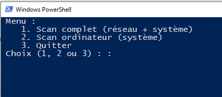
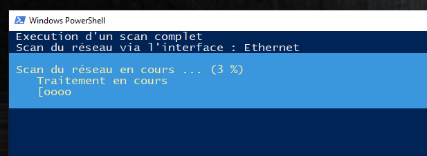
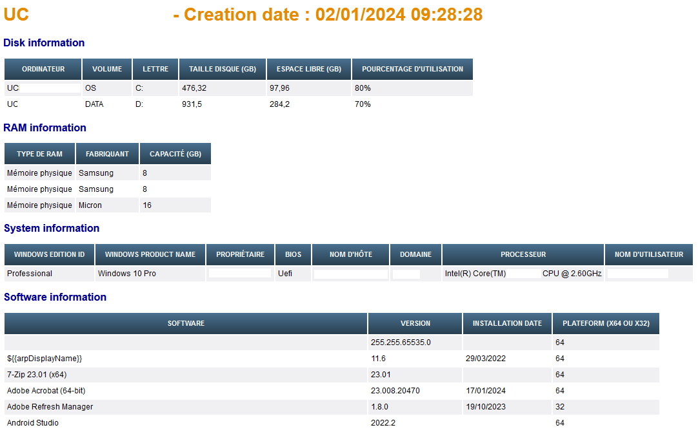

# Scan-Windows_Collector

Automated windows scan to help with troubleshooting.

# How to launch it

1) This is a standard powershell script, you need to run it with administrator account.

  		=> `.\Windows_Collector.ps1`

  

2) Scan in progress :

  

  

3. Result (HTML report) :

   

# Functions

  - List all available network interfaces and for each interface, scan of the associated network (PING + ARP).
  - List all drives (USB/DISQUE/CD-DVD).
  - Collecting information about the system (OS, Processor, Hostname, etc...).
  - List all installed sorftware.
  - Generating a HTML report.
  - Tested only on Windows 10 and Windows 11.
